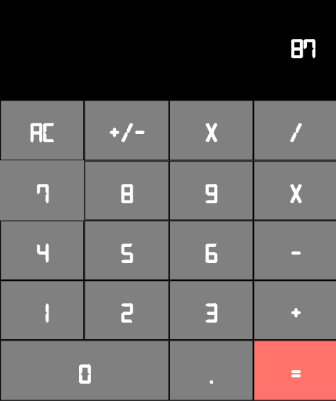

<h3 align="center">Calculator</h3>

  <p align="center">
    React Project
    <br />
    <br />
    <a href="https://fracalc.herokuapp.com/">View Demo</a>
    ·
    <a href="https://github.com/wathigo/Calculator/issues">Report Bug</a>
    ·
    <a href="https://github.com/wathigo/Calculator/issues">Request Feature</a>
  </p>
</p>


<!-- TABLE OF CONTENTS -->
## Table of Contents

* [About the Project](#about-the-project)
  * [Built With](#built-with)
  * [Deployment](#Deployment)
* [Contact](#Contact)


<!-- ABOUT THE PROJECT -->
## About The Project
<p align="center">
 <a href="#">
   
 </a>
</p>
The purpose of this project is to have a great introduction to react.

## Tests
Currently, there are no tests for this project.

The work done so far can be seen in the following url:

Deployed to heroku in https://fracalc.herokuapp.com/

### Deployment

Clone the repository to your working environment.

```
git clone git@github.com:wathigo/Calculator.git
```
Install dependancies

```
npm -i
```

Run the project on a local server

```
npm start
```


### Built With
* [React](https://reactjs.org/)

### Contact
* [Simon Wathigo](https://github.com/wathigo) - wathigosimon@gmail.com - [Linkedin](https://www.linkedin.com/in/simon-wathigo-445370183/)
